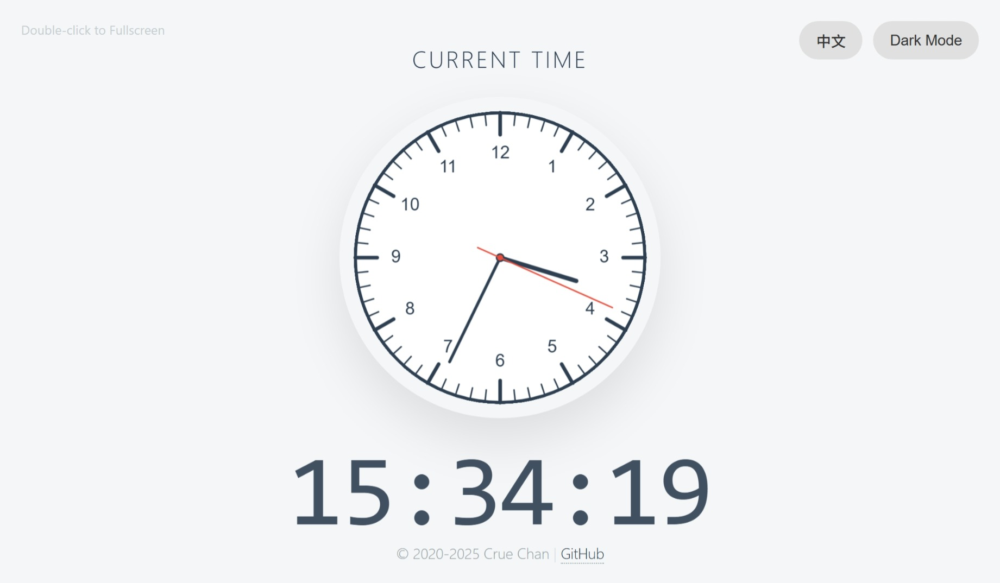
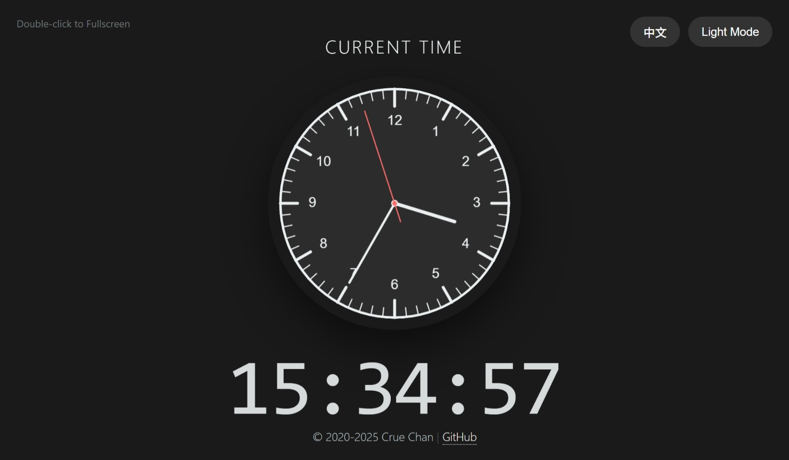

# Responsive Exam Clock


> A minimalist, browser-based clock designed for exams, interviews, and presentations.

**[🔴 View Live Demo](https://cruechan.github.io/exam-clock/)**

---

## 📖 Overview

**Responsive Exam Clock** is a single-file web utility built to display the current time clearly and elegantly on any screen. 

Unlike standard system clocks, this tool is optimized for **projection** and **distance reading**. It features a Swiss-style analog face paired with a tabular-numeral digital display, ensuring readability whether displayed on a 100-inch projector screen or a 13-inch laptop.

## ✨ Features

* **🇨🇭 Swiss Design**: A clean, distraction-free interface inspired by classic Swiss railway clocks.
* **🌗 Dark & Light Themes**: One-click toggle to switch between themes, perfect for dim exam rooms or bright classrooms.
* **📱 True Responsiveness**: The canvas redraws itself on window resize, ensuring crisp graphics on Retina/4K displays and correct proportions on any device.
* **⚡ Double-Click Fullscreen**: simple gesture control to maximize the display and hide browser UI.
* **🌐 Bilingual Interface**: Built-in support for English and Chinese (switchable via UI).
* **🚀 Zero Dependencies**: Built with pure Vanilla JS, HTML5 Canvas, and CSS3. No frameworks, no installation required.

## 📸 Screenshots

| Light Mode | Dark Mode |
|:---:|:---:|
|  |  |

## 🛠️ How to Use

### Method 1: Direct Usage (Recommended)
Simply download the `index.html` file and open it in any modern web browser (Chrome, Edge, Firefox, Safari).

### Method 2: Host it yourself
Since this is a static site, you can host it anywhere.
1. Clone the repository:
   ```bash
   git clone https://github.com/cruechan/exam-clock.git
   ```

2.  Open `index.html`.

## 💻 Tech Stack

  - **HTML5 Canvas**: For high-performance, vector-like rendering of the clock face.
  - **CSS3 Variables**: For efficient theming (Dark/Light mode logic).
  - **Vanilla JavaScript**: For logic, time calculation, and responsive event handling.

## 📄 License

This project is licensed under the MIT License - see the [LICENSE](LICENSE) file for details.

-----


**Created by [Crue Chan](https://github.com/cruechan)**
